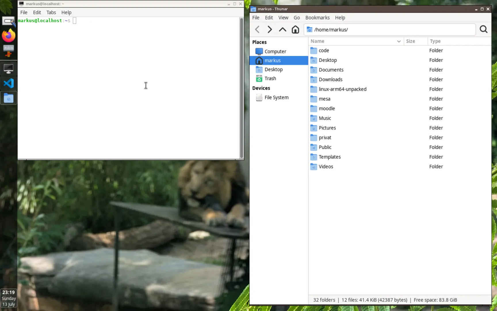

# Android on Linux: Termux X11 Desktop

This is the documentation on how i set up my desktop environment on my Xiaomi Pad 6 (pipa) with PixelOS. It's based on DroidMasters [Termux-Desktops](https://github.com/LinuxDroidMaster/Termux-Desktops) project.




## Evaluation of Approaches
I am aiming on being able to actually work on my Tablet. For example i want to be able to debug a software issue requiring a proper IDE.

My evaluation for the 4 possible Approaches

- Android builtin Linux VM (new in Android 15 -> Developer settings): It's a VM. Comes with lots of overhead, especially with memory. Sharing 8GB between Android and Linux with UI with VM approach ... dont like it. Not available on pipa (kernel does not support kvm)
- Termux native: Worked, but does not support relevant Applications, or only with lots of workarounds. Jetbrains IDEs did run, but only with a few workarounds and still some issues. VSCode did only run as Browser-Version, which does not support many plugins. Did not try [glibc-runner](https://github.com/LinuxDroidMaster/Termux-Desktops/blob/main/Documentation/terminology.md)
- Proot: Worked fine, setup was easy, but performance was bad. Starting Firefox and loading the webpages to download two applications took minutes. Would technically fullfill my requirements, but would not be a fun experience
- Chroot: Most complex to set up, but solves most issues the other approaches have.

## Known Issues
- Docker is not possible as of missing kernel features. I did work around this by using a 2nd device with kvm support.
- Screen recording (eg with OBS) is not working. This is very likely fixable.
- Using external storage devices needs manual mounting (mount --bind) and unmounting.
- There are some permission issues with fuse and applications using sandboxing (eg AppImages). For now I am working around this by using sudo / disabling sandboxing.

## General
Pixel OS 15, Magisk for root.

> [!WARNING]
> As of Magisk 29.0 [`tsu` is broken](https://github.com/cswl/tsu/issues/114#issuecomment-2888315026)

It shows an error message including `Inappropriate ioctl for device`. As workaround remove the `tsu` package and use `sudo bash` instead. 
It achieves a simmilar result. It is important to remove tsu, as with tsu installed it also replaces the sudo command.

```bash
pkg remove tsu && pkg i sudo
```


### Termux X11
In Preferences
- activate Keyboard -> Enable Acessibility services for intercepting system shortcuts manually
  - In case the option is grayed out open the Android Settings -> Apps, find Termux X11 -> 3 dots -> Eingeschr'nkte Einstellungen zulassen
- activate Keyboard -> Prefer scancodes when possible
- activate Pointer -> Touchscreen input mode -> Direct touch
- Enable Screen scaling
    - Output -> Displaz resolution mode: scaled
    - Output -> Displaz scale, %: 200 (adjust to your needs)

# Guides
- [My Debian Trixie chroot guide](./Documentation/debian_chroot.md)
- [Hardware acceleration and x86 support](./Documentation/hardware_acceleration.md)

# Documentation on specific topics
- [Docker](./Documentation/docker.md)
- [Comparison of desktop environments](./Documentation/desktop_environments.md)
- [zram](./Documentation/zram.md)
